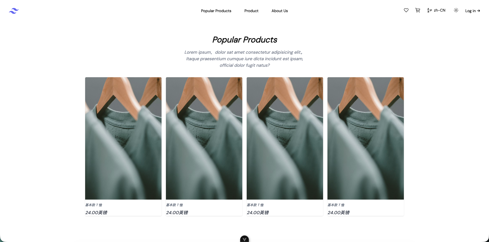
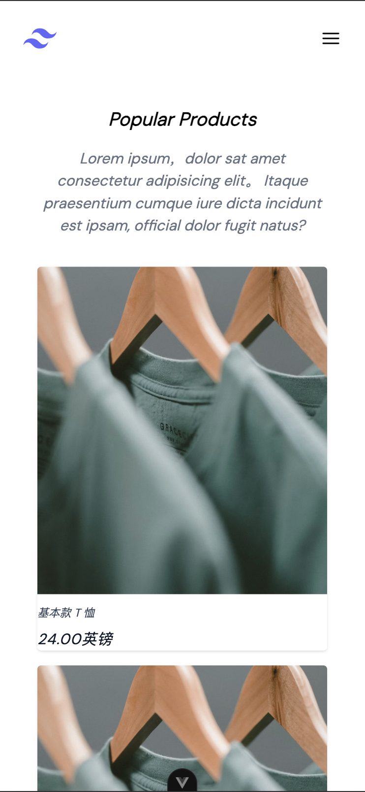

## shoping

精美的电子商务模版，响应式支持

## 预览

### PC



### Mobile



<br>

## 特性

- ⚡️ [Vue 3](https://github.com/vuejs/core), [Vite](https://github.com/vitejs/vite), [pnpm](https://pnpm.io/), [esbuild](https://github.com/evanw/esbuild) - 就是快！

- 📦 [组件自动化加载](./src/components)

- 🍍 [使用 Pinia 的状态管理](https://pinia.vuejs.org)

- 📲 [PWA](https://github.com/antfu/vite-plugin-pwa)

- 🎨 [UnoCSS](https://github.com/unocss/unocss) - 高性能且极具灵活性的即时原子化 CSS 引擎

- 😃 [各种图标集为你所用](https://github.com/antfu/unocss/tree/main/packages/preset-icons)

- 🌍 [I18n 国际化开箱即用](./locales)

- 🗒 [Markdown 支持](https://github.com/unplugin/unplugin-vue-markdown)

- 🔥 使用 [新的 `<script setup>` 语法](https://github.com/vuejs/rfcs/pull/227)

- 📥 [API 自动加载](https://github.com/unplugin/unplugin-auto-import) - 直接使用 Composition API 无需引入

- 🦔 使用 [beasties](https://github.com/danielroe/beasties) 的生成关键 CSS

- 🦾 TypeScript, 当然

- ⚙️ 结合 [GitHub Actions](https://github.com/features/actions)，使用 [Vitest](https://github.com/vitest-dev/vitest) 进行单元测试, [Cypress](https://cypress.io/) 进行 E2E 测试

<br>

## 预配置

### UI 框架

- [UnoCSS](https://github.com/antfu/unocss) - 高性能且极具灵活性的即时原子化 CSS 引擎

### Icons

- [Iconify](https://iconify.design) - 使用任意的图标集，浏览：[🔍Icônes](https://icones.netlify.app/)
- [UnoCSS 的纯 CSS 图标方案](https://github.com/antfu/unocss/tree/main/packages/preset-icons)

### 插件

- [Vue Router](https://github.com/vuejs/router)
  - [`unplugin-vue-router`](https://github.com/posva/unplugin-vue-router) - 以文件系统为基础的路由
- [Pinia](https://pinia.vuejs.org) - 直接的, 类型安全的, 使用 Composition API 的轻便灵活的 Vue 状态管理
- [`unplugin-vue-components`](https://github.com/antfu/unplugin-vue-components) - 自动加载组件
- [`unplugin-auto-import`](https://github.com/antfu/unplugin-auto-import) - 直接使用 Composition API 等，无需导入
- [`vite-plugin-pwa`](https://github.com/antfu/vite-plugin-pwa) - PWA
- [`unplugin-vue-markdown`](https://github.com/unplugin/unplugin-vue-markdown) - Markdown 作为组件，也可以让组件在 Markdown 中使用
  - [`markdown-it-prism`](https://github.com/jGleitz/markdown-it-prism) - [Prism](https://prismjs.com/) 的语法高亮
  - [`prism-theme-vars`](https://github.com/antfu/prism-theme-vars) - 利用 CSS 变量自定义 Prism.js 的主题
- [Vue I18n](https://github.com/intlify/vue-i18n-next) - 国际化
  - [`unplugin-vue-i18n`](https://github.com/intlify/bundle-tools/tree/main/packages/unplugin-vue-i18n) - Vue I18n 的 Vite 插件
- [VueUse](https://github.com/antfu/vueuse) - 实用的 Composition API 工具合集
- [`@vueuse/head`](https://github.com/vueuse/head) - 响应式地操作文档头信息
- [`vite-plugin-vue-devtools`](https://github.com/webfansplz/vite-plugin-vue-devtools) - 旨在增强Vue开发者体验的Vite插件

### 编码风格

- 使用 Composition API 地 [`<script setup>` SFC 语法](https://github.com/vuejs/rfcs/pull/227)
- [ESLint](https://eslint.org/) 配置为 [@antfu/eslint-config](https://github.com/antfu/eslint-config), 单引号, 无分号.

### 开发工具

- [TypeScript](https://www.typescriptlang.org/)
- [Vitest](https://github.com/vitest-dev/vitest) - 基于 Vite 的单元测试框架
- [pnpm](https://pnpm.js.org/) - 快, 节省磁盘空间的包管理器
  - [beasties](https://github.com/danielroe/beasties) - 关键 CSS 生成器
- [VS Code 扩展](./.vscode/extensions.json)
  - [Vite](https://marketplace.visualstudio.com/items?itemName=antfu.vite) - 自动启动 Vite 服务器
  - [Volar](https://marketplace.visualstudio.com/items?itemName=Vue.volar) - Vue 3 `<script setup>` IDE 支持
  - [Iconify IntelliSense](https://marketplace.visualstudio.com/items?itemName=antfu.iconify) - 图标内联显示和自动补全
  - [i18n Ally](https://marketplace.visualstudio.com/items?itemName=lokalise.i18n-ally) - 多合一的 I18n 支持
  - [ESLint](https://marketplace.visualstudio.com/items?itemName=dbaeumer.vscode-eslint)

## 现在可以试试!

> Vitesse 需要 Node 版本 >=14.18

## 清单

使用此模板时，请尝试按照清单正确更新您自己的信息

- [ ] 在 `LICENSE` 中改变作者名
- [ ] 在 `App.vue` 中改变标题
- [ ] 在 `vite.config.ts` 更改主机名
- [ ] 在 `public` 目录下改变favicon
- [ ] 移除 `.github` 文件夹中包含资助的信息
- [ ] 整理 README 并删除路由

紧接着, 享受吧 :)

## 使用

### 开发

只需要执行以下命令就可以在 http://localhost:3333 中看到

```bash
pnpm dev
```

### 构建

构建该应用只需要执行以下命令

```bash
pnpm build
```

然后你会看到用于发布的 `dist` 文件夹被生成。
